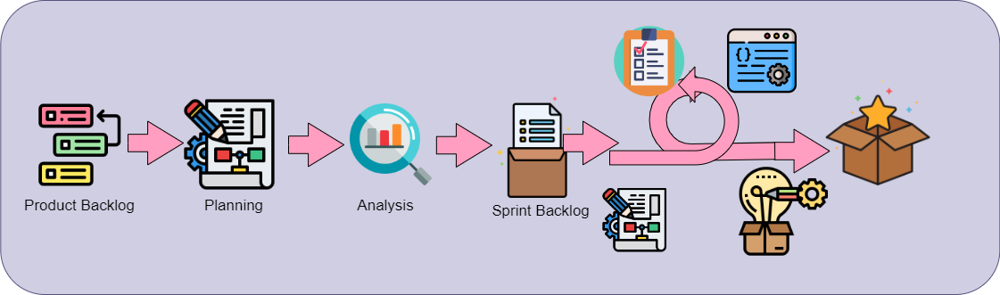

# Pet Monitoring Backend


## System Structure


## Software Development Lifecycle



---

[Swagger Route](http://127.0.0.1:8000/swagger/)

[Django System Check](http://127.0.0.1:8000/health/)

[Forest Admin](https://app.forestadmin.com/)

## Setup Project

### Step.1 Install Dependencies with pipenv

```shell
pipenv install
```

### Step.2 Constructor Environments with Docker-compose

```shell
docker-compose up
```

### Step.3 Environment Variables .env Setup

.env file
Please refer .env.example 
```dotenv
#Django
DJANGO_SECRET_KEY =
DEBUG =
#Elasticsearch
ELASTICSEARCH_ENDPOINT = 
#PostgreSQL
POSTGRES_DB =
POSTGRES_USER =
POSTGRES_PASSWORD =
POSTGRES_DB_URL =
#ChatGPT
CHATGPT_APIKEY = 
#RabbitMQ
RABBITMQ_ENABLE = 
RABBITMQ_USERNAME = 
RABBITMQ_PASSWORD = 
RABBITMQ_SERVER_IP = 
RABBITMQ_PORT = 
RABBITMQ_VIRTUAL_HOST = 
#Celery
BROKER_URL =
#Redis
REDIS_URL=
...
```

### Step.4 Migrate Schema to PostgreSQL

```shell
pipenv run python manage.py migrate
```

### Step.5 Migrate Index to Elasticsearch(django-elasticsearch-dsl)

```shell
pipenv run python manage.py search_index --create
```

### Step.6 Runserver

```shell
pipenv run python manage.py runserver 0.0.0.0:8000
```

### Step.7 Run Commands

```shell
pipenv run python manage.py recordListener
```

----

## Other

### Install Dependencies with venv

#### Create venv

```shell
python -m venv .
```

#### Activate venv

```shell
Scripts/activate
```

#### Deactivate venv

```shell
Scripts/deactivate
```

#### Install from requirements.txt

```shell
pip install -r requirements.txt
```

#### Freeze dependencies

```shell
pip freeze > requirements.txt
```

### Run Integration Test

```shell
python manage.py test api/tests/models --pattern="*Test.py" [--verbosity 2]# Unit Test --verbosity 2 is output detail
python manage.py test --pattern="*Test.py" #Intergration Test
python manage.py test  #Intergration Test
```

### Run with ASGI

```shell
daphne -b 0.0.0.0 -p 8000 PetMonitoringSystemBackend.asgi:application
```